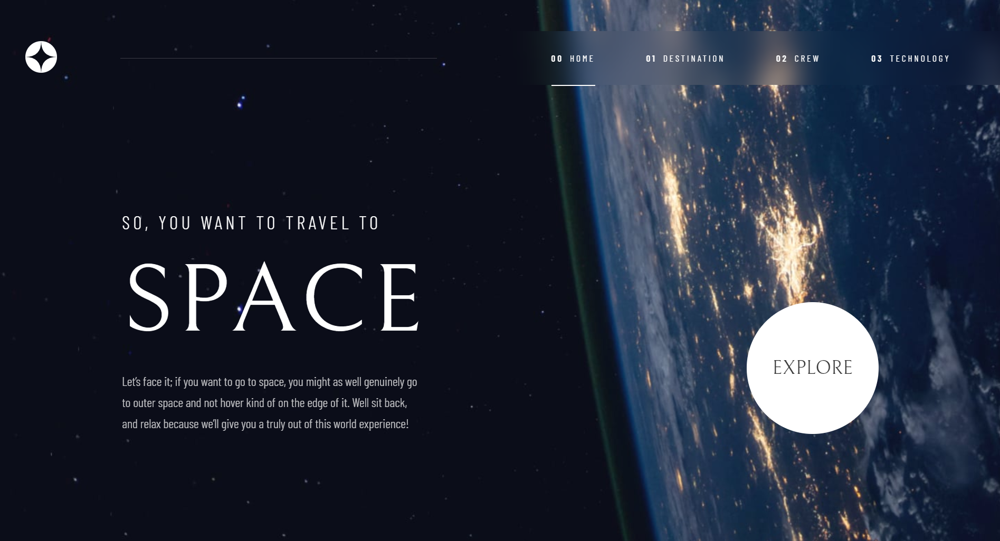

# Frontend Mentor - Space tourism website solution

This is a solution to the [Space tourism website challenge on Frontend Mentor](https://www.frontendmentor.io/challenges/space-tourism-multipage-website-gRWj1URZ3). Frontend Mentor challenges help you improve your coding skills by building realistic projects. 

## Table of contents

- [Frontend Mentor - Space tourism website solution](#frontend-mentor---space-tourism-website-solution)
  - [Table of contents](#table-of-contents)
  - [Overview](#overview)
    - [The challenge](#the-challenge)
    - [Screenshot](#screenshot)
    - [Links](#links)
  - [My process](#my-process)
    - [Built with](#built-with)
    - [What I learned](#what-i-learned)
    - [Continued development](#continued-development)
  - [Author](#author)

## Overview

### The challenge

Users should be able to:

- View the optimal layout for each of the website's pages depending on their device's screen size
- See hover states for all interactive elements on the page
- View each page and be able to toggle between the tabs to see new information

### Screenshot

### Links

- Live Site URL: [Click here](https://your-live-site-url.com)

## My process

### Built with

- Semantic HTML5 markup
- CSS custom properties
- Flexbox
- [React](https://reactjs.org/) - JS library

### What I learned

Throughout the duration of this project, I have acquired a wealth of knowledge and skills. Notably, I have expanded my expertise in CSS by mastering several new properties, enabling me to craft a responsive navbar that seamlessly adapts to diverse screen sizes, including the creation of a mobile-friendly hamburger menu. Furthermore, I have leveraged the SwiperJS library to design an intuitive slider for the crew page, facilitating effortless navigation through crew members via keyboard, pagination dots, or touch functionality on mobile devices.

### Continued development

Looking ahead, I am committed to further advancing my expertise in CSS. Moreover, I intend to augment my proficiency in React by exploring cutting-edge techniques in state management and component composition, ultimately elevating my ability to craft sophisticated, scalable, and maintainable front-end applications.

## Author

- Frontend Mentor - [@subhajitroycode](https://www.frontendmentor.io/profile/subhajitroycode)
- Twitter - [@subhajitroycode](https://www.twitter.com/subhajitroycode)
- LinkeIn - [@subhajitroycode](https://www.linkedin.com/in/subhajitroycode)
- Instragram - [@subhajitroycode](https://www.instagram.com/subhajitroycode)
